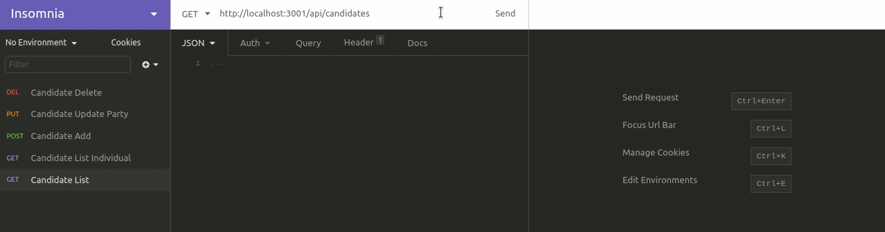

## ElectionSQL

This application database uses sqlite3 queries and express.js routes to create a working election node back end.

#### Issues

- [x] [Create database with candidates table](https://github.com/MBrassey/ElectionSQL/issues/1)
- [x] [Create the parties table](https://github.com/MBrassey/ElectionSQL/issues/2)
- [x] [Create the voters table](https://github.com/MBrassey/ElectionSQL/issues/3)
- [x] [Create the votes table](https://github.com/MBrassey/ElectionSQL/issues/4)

#### Requirements

- node.js
- npm

#### Installation

    npm i

#### Usage

    npm run migrate
    npm run seed
    ⟩ sqlite3 db/election.db
        SQLite version 3.29.0 2019-07-10 17:32:03
        Enter ".help" for usage hints.
        sqlite> INSERT INTO votes (voter_id, candidate_id)
        ...> VALUES(3,1), (4,2), (5,2), (6,2), (7,2), (8,3), (9,3);
        sqlite> .quit
    npm start

    Example Requests:
    GET: http://localhost:3001/api/candidates
    GET: http://localhost:3001/api/candidate/7
    POST: http://localhost:3001/api/candidate
    PUT: http://localhost:3001/api/candidate/7
    DELETE: http://localhost:3001/api/candidate/7

<h6>
:cyclone: Click the image(s) below to view the live <a id="Screenshots" href="https://election-sql-mbrassey.herokuapp.com/api/candidates">webapplication</a>
</h6>

[
](https://election-sql-mbrassey.herokuapp.com/api/candidates)

#### Questions

Contact me at [matt@brassey.io](mailto:matt@brassey.io) with any questions or comments.

#### License

`ElectionSQL` is published under the **CC0_1.0_Universal** license.

> The Creative Commons CC0 Public Domain Dedication waives copyright interest in a work you've created and dedicates it to the world-wide public domain. Use CC0 to opt out of copyright entirely and ensure your work has the widest reach. As with the Unlicense and typical software licenses, CC0 disclaims warranties. CC0 is very similar to the Unlicense.
